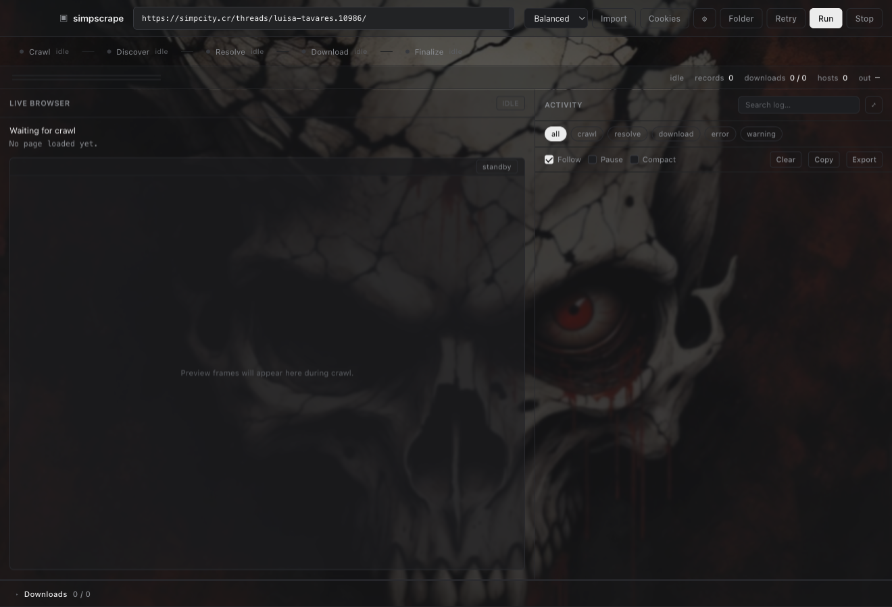
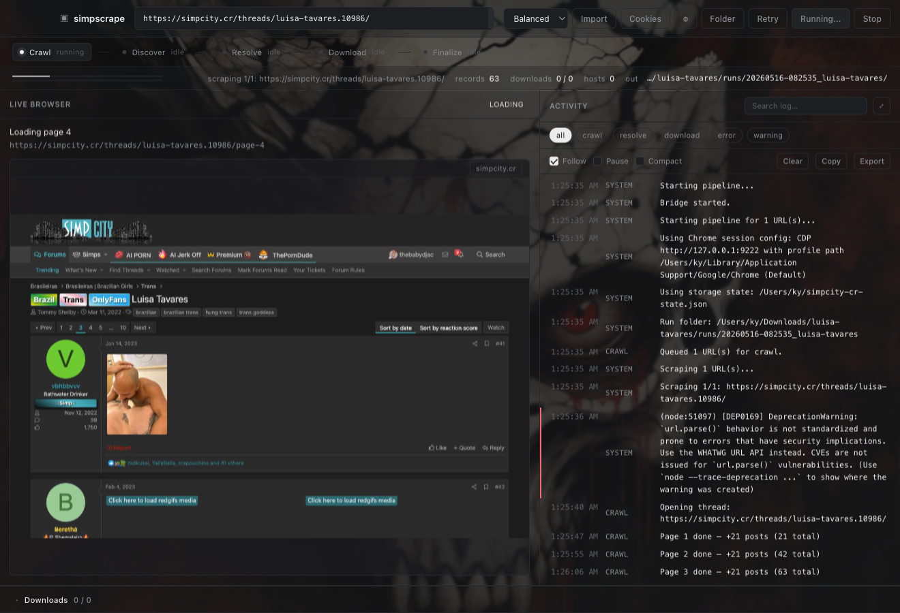
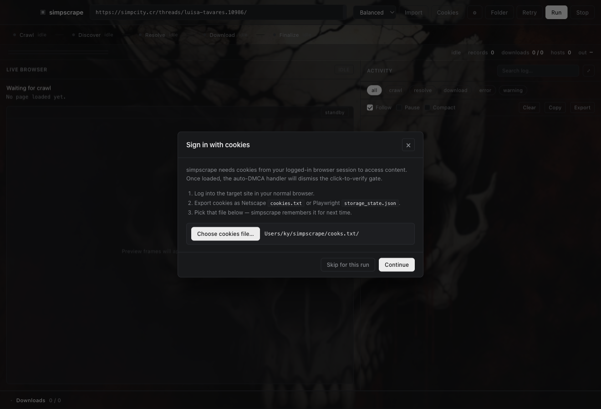
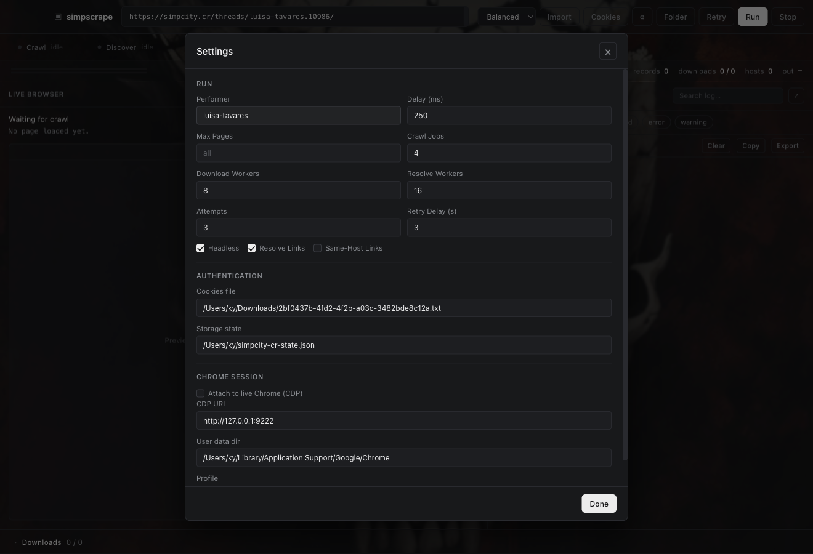

# simpscrape

A scraper toolkit for forum-style media threads. It crawls a thread, discovers
embedded media links, resolves them across hosts, then hands the URLs off to
[gallery-dl](https://github.com/mikf/gallery-dl) and
[yt-dlp](https://github.com/yt-dlp/yt-dlp) for the actual downloading.

It ships with three frontends:

- **Electron GUI** (default `./simp gui`) — minimal monochrome UI with a live
Playwright preview of the page being crawled and a real-time activity feed.
- **Tk GUI fallback** — used automatically if `gui/node_modules` is not built.
- **CLI** — every workflow that exists in the GUI is also a `cli.py` subcommand.

The crawler ships with an auto-DMCA / consent-gate dismisser so click-to-verify
interstitials (e.g. simpcity.cr) don't stop a run.

## Screenshots

Idle state — paste a URL, pick a profile, hit Run:



Mid-crawl — live thread preview, stage rail (Crawl → Discover → Resolve →
Download → Finalize), running activity feed, downloads drawer:



Cookies prompt at first launch — pick a Netscape `cookies.txt` or Playwright
`storage_state.json` from your already-logged-in browser session:



Settings modal — performer/folder, concurrency, auth files, Chrome
attach options:



## Quick start

```bash
git clone https://github.com/youruser/simpscrape.git
cd simpscrape
python3 -m venv .venv
source .venv/bin/activate
pip install -r requirements.txt
python -m playwright install chromium

# Optional GUI deps (Node + Electron). Skip and the Tk fallback is used.
cd gui && npm install && cd ..

./simp gui
```

The wrappers (`./simp`, `./simp-gui`) self-heal: if Playwright or Chromium is
missing they install them on the first run.

## Requirements

- Python 3.10+
- Playwright Chromium (installed automatically on first run)
- Optional download tools: `gallery-dl`, `yt-dlp` (recommended; install via
`pipx` or `brew`)
- Optional GUI: Node 18+ and `electron` (`npm install` inside `gui/`)

## Using the GUI

1. **Launch:** `./simp gui` (or `npm start` from `gui/`).
2. **Cookies (first time only):** the cookies modal opens automatically. Point
  it at a Netscape `cookies.txt` exported from your logged-in browser, or at a
   Playwright `storage_state.json`. The choice is remembered in
   `~/.simpscrape_gui_settings.json` so you won't see this modal again.
3. **Paste a URL** into the top bar. One per line for batch runs.
4. **Profile:** Fast / Balanced / Deep — controls how aggressively the crawler
  waits for content vs. moves on. Balanced is the right choice for forums.
5. **Run.** The pipeline streams events to the right-hand activity feed and the
  stage rail. The middle pane shows JPEG previews of every page Playwright
   loads, including the moment the auto-DMCA gate is dismissed.
6. **Downloads drawer** (bottom, click to expand) shows per-URL progress with
  five-segment phase bars: queued → resolving → fetching → verifying →
   complete (or fail).
7. **Settings modal** (gear icon) hides everything you rarely change: workers,
  attempts, retry delay, headless toggle, cookies/storage-state paths, and
   the optional Chrome attach.

The "Stop" button cleanly tears down the Python subprocess and Playwright
browser.

## Using the CLI

Every flow above is also a CLI subcommand. The CLI is the same Python code; the
GUI is just an Electron skin over `gui_bridge.py`.

```bash
# Quick scrape one or more URLs (records → JSON, no download stage)
./simp "https://example.com/thread/123" --output out.json

# Full pipeline: crawl + discover + resolve + download
python3 cli.py universal "https://example.com/thread/123" --workspace runs/

# Discovery only (skip the gallery-dl/yt-dlp stage)
python3 cli.py universal "https://example.com/thread/123" \
  --workspace runs/ --no-download

# Sitemap-driven scrape
python3 cli.py run --sitemap my-sitemap.json --output records.json --format json

# Save an authenticated session for later runs
python3 cli.py login --url https://simpcity.cr/login \
  --output-state simpcity-state.json

# Reuse that session
python3 cli.py universal "https://example.com/thread/123" \
  --storage-state simpcity-state.json
```

## Authentication

simpscrape reads auth in this priority order:

1. `--storage-state path.json` (Playwright dump, includes cookies + localStorage)
2. `--cookies path.txt` (Netscape cookies.txt — get one with the
  "Get cookies.txt LOCALLY" extension or any equivalent exporter)
3. Live Chrome via `--chrome` (CDP attach to a running Chrome with
  `--remote-debugging-port=9222`)
4. Live Chrome via `--chrome-user-data-dir` (Playwright launches its own Chrome
  pointed at your real profile dir)

When the auto-DMCA handler clears a click-to-verify gate, the post-dismissal
storage state is written back to the same `storage_state` file (or a new
`~/.simpscrape/<host>-state.json`) so the next run starts pre-cleared.

## Live Chrome attach (most robust auth path)

If you'd rather use the same logins your normal browser already has:

```bash
# Quit Chrome, then relaunch it with the debugging port enabled.
open -na "Google Chrome" --args --remote-debugging-port=9222

python3 cli.py universal "https://simpcity.cr/threads/luisa-tavares.10986/" \
  --chrome
```

Or attach to a profile directory directly without relaunching Chrome in
debug mode:

```bash
python3 cli.py universal "https://example.com/thread/123" \
  --chrome-user-data-dir "$HOME/Library/Application Support/Google/Chrome" \
  --chrome-profile-directory Default
```

The Chrome extension bridge in `chrome_extension/` is the no-config option:
keep simpscrape's storage state in sync with normal Chrome logins by clicking
"Track this site" from the popup. See [chrome_extension/README.md](chrome_extension/README.md)
and:

```bash
./simp chrome-bridge-info
./simp chrome-bridge-install --extension-id YOUR_EXTENSION_ID
```

## DMCA / consent gate handling

`core/interstitial.py` carries a small ruleset of click-to-verify and consent
selectors (simpcity.cr DMCA, generic XenForo `_xfNotice`, generic GDPR
"Accept all"). Every `page.goto()` runs them after `domcontentloaded` and
before content extraction. When a gate is dismissed:

- The crawl emits an `interstitial_dismissed` event (visible in the activity
feed: "Auto-dismissed click-to-verify gate. Session saved.").
- The current Playwright `storage_state` is exported to
`--storage-state` (or `~/.simpscrape/<host>-state.json` if no path was set),
so the gate is remembered for next time.

## Troubleshooting

- **GUI sits on "Running…" forever, no log lines, no preview.** The renderer's
IPC handler isn't registered. Run `./simp gui` from a terminal with
`SIMPSCRAPE_DEBUG=1 ./simp gui` to see the bridge stdout — every JSON event
the Python subprocess emits is logged. If events flow but the GUI is silent,
the renderer threw during `app.js` init (likely a TDZ error on a `const`).
- **Bridge output looks fine but the GUI still freezes.** Some library may be
redirecting stdout. The bridge expects one JSON object per line on stdout
with no other writes. `core/crawl_controller.py` already opts out of
`rich.progress` redirecting stdout/stderr; if you add a new spinner library,
do the same.
- **"DDoS-Guard blocked simpcity.cr".** simpcity occasionally serves a real
challenge in addition to the DMCA gate. Open the URL in a visible browser,
let the check clear, then refresh `simpcity-cr-state.json` — or use
`--chrome` so simpscrape attaches directly to your live Chrome.
- **Downloads silently fail with `429` / cookie errors.** Your cookies file is
stale. Re-export and pick it again from the Cookies modal, or just delete
`~/.simpscrape_gui_settings.json` to be re-prompted.
- **Headless detection.** The Playwright driver pins a North-American Chrome
locale/timezone and patches `navigator.webdriver`. If a host still flags it,
uncheck "Headless" in Settings (or `--no-headless` on the CLI) and let it
run with a visible window.

## Project layout

```
simpscrape/
├── cli.py                  # CLI entrypoint (typer)
├── gui_bridge.py           # JSON-line IPC bridge between Electron and Python
├── core/
│   ├── pipeline.py         # crawl → discover → resolve → download orchestration
│   ├── crawl_controller.py # page-by-page crawling, pagination
│   ├── interstitial.py     # auto-DMCA / consent gate dismisser + rules
│   ├── universal_downloader.py  # gallery-dl / yt-dlp / direct-http fan-out
│   ├── url_discovery.py    # link extraction + host classification
│   └── browser_config.py   # CDP / user-data-dir / channel resolution
├── drivers/
│   └── playwright_driver.py # Playwright wrapper used by the controller
├── gui/                    # Electron app (main + preload + renderer)
├── chrome_bridge/          # Native messaging host for the Chrome extension
├── chrome_extension/       # MV3 extension that mirrors live Chrome cookies
├── universal_gui.py        # Tk fallback GUI used when Electron isn't built
├── tests/                  # unittest suite
└── demo/                   # README screenshots
```

## Development

```bash
# Run the test suite
python3 -m unittest discover tests

# Run the bridge end-to-end against a config without launching Electron
echo '{"urls":["https://example.com/thread"], "performer":"x", "captureProfile":"balanced", "headless":true, "delay":250, "crawlJobs":2, "downloadWorkers":4, "resolveWorkers":4, "attempts":1, "retryDelay":1, "resolveLinks":true, "includeSourceHosts":false, "useChrome":false, "chromeCdpUrl":"", "chromeUserDataDir":"", "chromeProfileDirectory":"", "storageState":"", "cookies":""}' \
  | .venv/bin/python -u gui_bridge.py | head

# Launch Electron with bridge tracing
SIMPSCRAPE_DEBUG=1 ./simp gui
```

## License

MIT. See `LICENSE`. Use only on content you are authorized to access and
download.